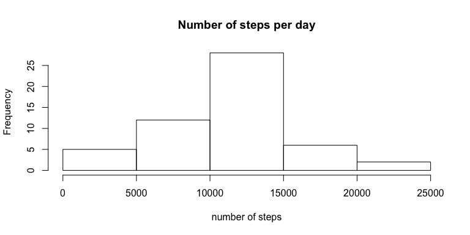
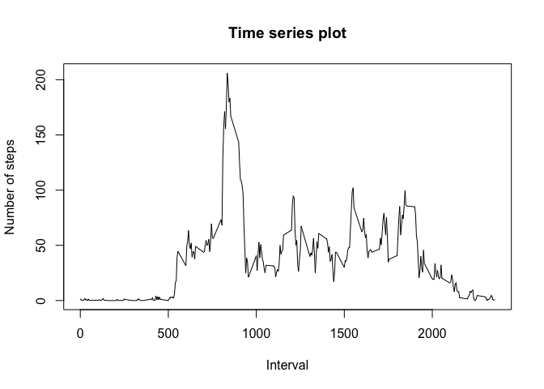
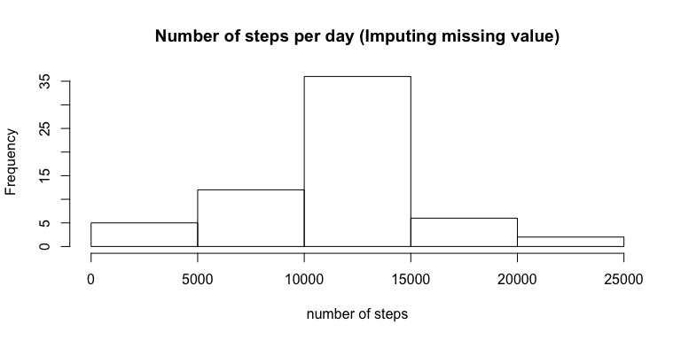
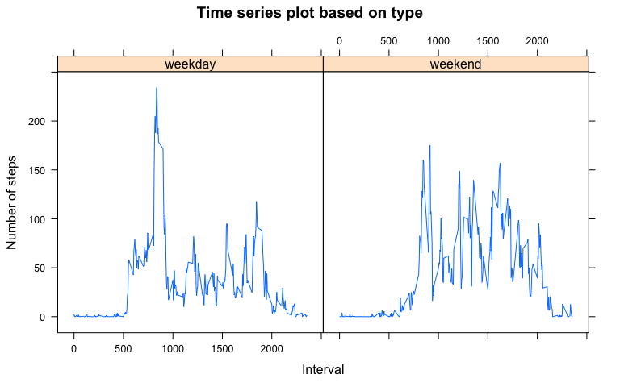

# Reproducible Research: Peer Assessment 1


## Loading and preprocessing the data


```r
  library("data.table");
```

```
## Warning: package 'data.table' was built under R version 3.1.3
```

```r
  library("xtable");
  activity <- data.table(read.csv("data/activity.csv"));
```


## What is mean total number of steps taken per day?

- Total number of stpes per day

```r
num_of_steps = xtable(activity[!is.na(steps),list( num_of_steps = sum(steps)), by=date]);
print(num_of_steps, type="html", include.rownames = FALSE);
```

<!-- html table generated in R 3.1.2 by xtable 1.7-4 package -->
<!-- Sun Aug 16 08:06:19 2015 -->
<table border=1>
<tr> <th> date </th> <th> num_of_steps </th>  </tr>
  <tr> <td> 2012-10-02 </td> <td align="right"> 126 </td> </tr>
  <tr> <td> 2012-10-03 </td> <td align="right"> 11352 </td> </tr>
  <tr> <td> 2012-10-04 </td> <td align="right"> 12116 </td> </tr>
  <tr> <td> 2012-10-05 </td> <td align="right"> 13294 </td> </tr>
  <tr> <td> 2012-10-06 </td> <td align="right"> 15420 </td> </tr>
  <tr> <td> 2012-10-07 </td> <td align="right"> 11015 </td> </tr>
  <tr> <td> 2012-10-09 </td> <td align="right"> 12811 </td> </tr>
  <tr> <td> 2012-10-10 </td> <td align="right"> 9900 </td> </tr>
  <tr> <td> 2012-10-11 </td> <td align="right"> 10304 </td> </tr>
  <tr> <td> 2012-10-12 </td> <td align="right"> 17382 </td> </tr>
  <tr> <td> 2012-10-13 </td> <td align="right"> 12426 </td> </tr>
  <tr> <td> 2012-10-14 </td> <td align="right"> 15098 </td> </tr>
  <tr> <td> 2012-10-15 </td> <td align="right"> 10139 </td> </tr>
  <tr> <td> 2012-10-16 </td> <td align="right"> 15084 </td> </tr>
  <tr> <td> 2012-10-17 </td> <td align="right"> 13452 </td> </tr>
  <tr> <td> 2012-10-18 </td> <td align="right"> 10056 </td> </tr>
  <tr> <td> 2012-10-19 </td> <td align="right"> 11829 </td> </tr>
  <tr> <td> 2012-10-20 </td> <td align="right"> 10395 </td> </tr>
  <tr> <td> 2012-10-21 </td> <td align="right"> 8821 </td> </tr>
  <tr> <td> 2012-10-22 </td> <td align="right"> 13460 </td> </tr>
  <tr> <td> 2012-10-23 </td> <td align="right"> 8918 </td> </tr>
  <tr> <td> 2012-10-24 </td> <td align="right"> 8355 </td> </tr>
  <tr> <td> 2012-10-25 </td> <td align="right"> 2492 </td> </tr>
  <tr> <td> 2012-10-26 </td> <td align="right"> 6778 </td> </tr>
  <tr> <td> 2012-10-27 </td> <td align="right"> 10119 </td> </tr>
  <tr> <td> 2012-10-28 </td> <td align="right"> 11458 </td> </tr>
  <tr> <td> 2012-10-29 </td> <td align="right"> 5018 </td> </tr>
  <tr> <td> 2012-10-30 </td> <td align="right"> 9819 </td> </tr>
  <tr> <td> 2012-10-31 </td> <td align="right"> 15414 </td> </tr>
  <tr> <td> 2012-11-02 </td> <td align="right"> 10600 </td> </tr>
  <tr> <td> 2012-11-03 </td> <td align="right"> 10571 </td> </tr>
  <tr> <td> 2012-11-05 </td> <td align="right"> 10439 </td> </tr>
  <tr> <td> 2012-11-06 </td> <td align="right"> 8334 </td> </tr>
  <tr> <td> 2012-11-07 </td> <td align="right"> 12883 </td> </tr>
  <tr> <td> 2012-11-08 </td> <td align="right"> 3219 </td> </tr>
  <tr> <td> 2012-11-11 </td> <td align="right"> 12608 </td> </tr>
  <tr> <td> 2012-11-12 </td> <td align="right"> 10765 </td> </tr>
  <tr> <td> 2012-11-13 </td> <td align="right"> 7336 </td> </tr>
  <tr> <td> 2012-11-15 </td> <td align="right">  41 </td> </tr>
  <tr> <td> 2012-11-16 </td> <td align="right"> 5441 </td> </tr>
  <tr> <td> 2012-11-17 </td> <td align="right"> 14339 </td> </tr>
  <tr> <td> 2012-11-18 </td> <td align="right"> 15110 </td> </tr>
  <tr> <td> 2012-11-19 </td> <td align="right"> 8841 </td> </tr>
  <tr> <td> 2012-11-20 </td> <td align="right"> 4472 </td> </tr>
  <tr> <td> 2012-11-21 </td> <td align="right"> 12787 </td> </tr>
  <tr> <td> 2012-11-22 </td> <td align="right"> 20427 </td> </tr>
  <tr> <td> 2012-11-23 </td> <td align="right"> 21194 </td> </tr>
  <tr> <td> 2012-11-24 </td> <td align="right"> 14478 </td> </tr>
  <tr> <td> 2012-11-25 </td> <td align="right"> 11834 </td> </tr>
  <tr> <td> 2012-11-26 </td> <td align="right"> 11162 </td> </tr>
  <tr> <td> 2012-11-27 </td> <td align="right"> 13646 </td> </tr>
  <tr> <td> 2012-11-28 </td> <td align="right"> 10183 </td> </tr>
  <tr> <td> 2012-11-29 </td> <td align="right"> 7047 </td> </tr>
   </table>

- Total number of steps per day (histogram)

```r
hist(num_of_steps$num_of_steps, main = "Number of steps per day", xlab = "number of steps");
```



- Mean and Median for  number of stpes per day 

```r
num_of_steps = xtable(activity[!is.na(steps),list(mean_num_steps = mean(steps),  median_num_steps = median(steps)), by=date]);
print(num_of_steps, type="html", include.rownames = FALSE);
```

<!-- html table generated in R 3.1.2 by xtable 1.7-4 package -->
<!-- Sun Aug 16 08:06:19 2015 -->
<table border=1>
<tr> <th> date </th> <th> mean_num_steps </th> <th> median_num_steps </th>  </tr>
  <tr> <td> 2012-10-02 </td> <td align="right"> 0.44 </td> <td align="right"> 0.00 </td> </tr>
  <tr> <td> 2012-10-03 </td> <td align="right"> 39.42 </td> <td align="right"> 0.00 </td> </tr>
  <tr> <td> 2012-10-04 </td> <td align="right"> 42.07 </td> <td align="right"> 0.00 </td> </tr>
  <tr> <td> 2012-10-05 </td> <td align="right"> 46.16 </td> <td align="right"> 0.00 </td> </tr>
  <tr> <td> 2012-10-06 </td> <td align="right"> 53.54 </td> <td align="right"> 0.00 </td> </tr>
  <tr> <td> 2012-10-07 </td> <td align="right"> 38.25 </td> <td align="right"> 0.00 </td> </tr>
  <tr> <td> 2012-10-09 </td> <td align="right"> 44.48 </td> <td align="right"> 0.00 </td> </tr>
  <tr> <td> 2012-10-10 </td> <td align="right"> 34.38 </td> <td align="right"> 0.00 </td> </tr>
  <tr> <td> 2012-10-11 </td> <td align="right"> 35.78 </td> <td align="right"> 0.00 </td> </tr>
  <tr> <td> 2012-10-12 </td> <td align="right"> 60.35 </td> <td align="right"> 0.00 </td> </tr>
  <tr> <td> 2012-10-13 </td> <td align="right"> 43.15 </td> <td align="right"> 0.00 </td> </tr>
  <tr> <td> 2012-10-14 </td> <td align="right"> 52.42 </td> <td align="right"> 0.00 </td> </tr>
  <tr> <td> 2012-10-15 </td> <td align="right"> 35.20 </td> <td align="right"> 0.00 </td> </tr>
  <tr> <td> 2012-10-16 </td> <td align="right"> 52.38 </td> <td align="right"> 0.00 </td> </tr>
  <tr> <td> 2012-10-17 </td> <td align="right"> 46.71 </td> <td align="right"> 0.00 </td> </tr>
  <tr> <td> 2012-10-18 </td> <td align="right"> 34.92 </td> <td align="right"> 0.00 </td> </tr>
  <tr> <td> 2012-10-19 </td> <td align="right"> 41.07 </td> <td align="right"> 0.00 </td> </tr>
  <tr> <td> 2012-10-20 </td> <td align="right"> 36.09 </td> <td align="right"> 0.00 </td> </tr>
  <tr> <td> 2012-10-21 </td> <td align="right"> 30.63 </td> <td align="right"> 0.00 </td> </tr>
  <tr> <td> 2012-10-22 </td> <td align="right"> 46.74 </td> <td align="right"> 0.00 </td> </tr>
  <tr> <td> 2012-10-23 </td> <td align="right"> 30.97 </td> <td align="right"> 0.00 </td> </tr>
  <tr> <td> 2012-10-24 </td> <td align="right"> 29.01 </td> <td align="right"> 0.00 </td> </tr>
  <tr> <td> 2012-10-25 </td> <td align="right"> 8.65 </td> <td align="right"> 0.00 </td> </tr>
  <tr> <td> 2012-10-26 </td> <td align="right"> 23.53 </td> <td align="right"> 0.00 </td> </tr>
  <tr> <td> 2012-10-27 </td> <td align="right"> 35.14 </td> <td align="right"> 0.00 </td> </tr>
  <tr> <td> 2012-10-28 </td> <td align="right"> 39.78 </td> <td align="right"> 0.00 </td> </tr>
  <tr> <td> 2012-10-29 </td> <td align="right"> 17.42 </td> <td align="right"> 0.00 </td> </tr>
  <tr> <td> 2012-10-30 </td> <td align="right"> 34.09 </td> <td align="right"> 0.00 </td> </tr>
  <tr> <td> 2012-10-31 </td> <td align="right"> 53.52 </td> <td align="right"> 0.00 </td> </tr>
  <tr> <td> 2012-11-02 </td> <td align="right"> 36.81 </td> <td align="right"> 0.00 </td> </tr>
  <tr> <td> 2012-11-03 </td> <td align="right"> 36.70 </td> <td align="right"> 0.00 </td> </tr>
  <tr> <td> 2012-11-05 </td> <td align="right"> 36.25 </td> <td align="right"> 0.00 </td> </tr>
  <tr> <td> 2012-11-06 </td> <td align="right"> 28.94 </td> <td align="right"> 0.00 </td> </tr>
  <tr> <td> 2012-11-07 </td> <td align="right"> 44.73 </td> <td align="right"> 0.00 </td> </tr>
  <tr> <td> 2012-11-08 </td> <td align="right"> 11.18 </td> <td align="right"> 0.00 </td> </tr>
  <tr> <td> 2012-11-11 </td> <td align="right"> 43.78 </td> <td align="right"> 0.00 </td> </tr>
  <tr> <td> 2012-11-12 </td> <td align="right"> 37.38 </td> <td align="right"> 0.00 </td> </tr>
  <tr> <td> 2012-11-13 </td> <td align="right"> 25.47 </td> <td align="right"> 0.00 </td> </tr>
  <tr> <td> 2012-11-15 </td> <td align="right"> 0.14 </td> <td align="right"> 0.00 </td> </tr>
  <tr> <td> 2012-11-16 </td> <td align="right"> 18.89 </td> <td align="right"> 0.00 </td> </tr>
  <tr> <td> 2012-11-17 </td> <td align="right"> 49.79 </td> <td align="right"> 0.00 </td> </tr>
  <tr> <td> 2012-11-18 </td> <td align="right"> 52.47 </td> <td align="right"> 0.00 </td> </tr>
  <tr> <td> 2012-11-19 </td> <td align="right"> 30.70 </td> <td align="right"> 0.00 </td> </tr>
  <tr> <td> 2012-11-20 </td> <td align="right"> 15.53 </td> <td align="right"> 0.00 </td> </tr>
  <tr> <td> 2012-11-21 </td> <td align="right"> 44.40 </td> <td align="right"> 0.00 </td> </tr>
  <tr> <td> 2012-11-22 </td> <td align="right"> 70.93 </td> <td align="right"> 0.00 </td> </tr>
  <tr> <td> 2012-11-23 </td> <td align="right"> 73.59 </td> <td align="right"> 0.00 </td> </tr>
  <tr> <td> 2012-11-24 </td> <td align="right"> 50.27 </td> <td align="right"> 0.00 </td> </tr>
  <tr> <td> 2012-11-25 </td> <td align="right"> 41.09 </td> <td align="right"> 0.00 </td> </tr>
  <tr> <td> 2012-11-26 </td> <td align="right"> 38.76 </td> <td align="right"> 0.00 </td> </tr>
  <tr> <td> 2012-11-27 </td> <td align="right"> 47.38 </td> <td align="right"> 0.00 </td> </tr>
  <tr> <td> 2012-11-28 </td> <td align="right"> 35.36 </td> <td align="right"> 0.00 </td> </tr>
  <tr> <td> 2012-11-29 </td> <td align="right"> 24.47 </td> <td align="right"> 0.00 </td> </tr>
   </table>

## What is the average daily activity pattern?

- Time series plot (i.e. type = "l") of the 5-minute interval (x-axis) and the average number of steps taken


```r
  res <- activity[,mean(steps, na.rm = TRUE), by=interval];
  plot(res$interval, res$V1, xlab = "Interval", ylab = "Number of steps", main = "Time series plot", type = "l");
```

 

- Maximum number of steps interval


```r
  res <- activity[,mean(steps, na.rm = TRUE), by=interval];
  paste("Maximam number of steps interval", res[res$V1 == max(res$V1)]$interval);
```

```
## [1] "Maximam number of steps interval 835"
```

## Imputing missing values

- Total number of missing values in the dataset

```r
  res <- activity[is.na(steps)];
  paste("Total Number missing", nrow(res));
```

```
## [1] "Total Number missing 2304"
```

- filling in all of the missing values in the dataset and creating dataset with field value (2 && 3)


```r
mean_by_interval <- activity[,mean(steps, na.rm = TRUE), by=interval];
fill_activity <- activity;
fill_activity[is.na(steps)]$steps <- as.integer(mean_by_interval[interval == fill_activity[is.na(steps)]$interval]$V1)
```

- Total number of steps per day (histogram) (Imputing missing value )


```r
hist(fill_activity[,sum(steps),by=date]$V1, main = "Number of steps per day (Imputing missing value)", xlab = "number of steps");
```



- Mean and Median for number of stpes per day (Imputing missing value )

```r
num_of_steps = xtable(fill_activity[!is.na(steps),list(mean_num_steps = mean(steps),  median_num_steps = median(steps)), by=date]);
print(num_of_steps, type="html", include.rownames = FALSE);
```

<!-- html table generated in R 3.1.2 by xtable 1.7-4 package -->
<!-- Sun Aug 16 08:06:19 2015 -->
<table border=1>
<tr> <th> date </th> <th> mean_num_steps </th> <th> median_num_steps </th>  </tr>
  <tr> <td> 2012-10-01 </td> <td align="right"> 36.95 </td> <td align="right"> 33.50 </td> </tr>
  <tr> <td> 2012-10-02 </td> <td align="right"> 0.44 </td> <td align="right"> 0.00 </td> </tr>
  <tr> <td> 2012-10-03 </td> <td align="right"> 39.42 </td> <td align="right"> 0.00 </td> </tr>
  <tr> <td> 2012-10-04 </td> <td align="right"> 42.07 </td> <td align="right"> 0.00 </td> </tr>
  <tr> <td> 2012-10-05 </td> <td align="right"> 46.16 </td> <td align="right"> 0.00 </td> </tr>
  <tr> <td> 2012-10-06 </td> <td align="right"> 53.54 </td> <td align="right"> 0.00 </td> </tr>
  <tr> <td> 2012-10-07 </td> <td align="right"> 38.25 </td> <td align="right"> 0.00 </td> </tr>
  <tr> <td> 2012-10-08 </td> <td align="right"> 36.95 </td> <td align="right"> 33.50 </td> </tr>
  <tr> <td> 2012-10-09 </td> <td align="right"> 44.48 </td> <td align="right"> 0.00 </td> </tr>
  <tr> <td> 2012-10-10 </td> <td align="right"> 34.38 </td> <td align="right"> 0.00 </td> </tr>
  <tr> <td> 2012-10-11 </td> <td align="right"> 35.78 </td> <td align="right"> 0.00 </td> </tr>
  <tr> <td> 2012-10-12 </td> <td align="right"> 60.35 </td> <td align="right"> 0.00 </td> </tr>
  <tr> <td> 2012-10-13 </td> <td align="right"> 43.15 </td> <td align="right"> 0.00 </td> </tr>
  <tr> <td> 2012-10-14 </td> <td align="right"> 52.42 </td> <td align="right"> 0.00 </td> </tr>
  <tr> <td> 2012-10-15 </td> <td align="right"> 35.20 </td> <td align="right"> 0.00 </td> </tr>
  <tr> <td> 2012-10-16 </td> <td align="right"> 52.38 </td> <td align="right"> 0.00 </td> </tr>
  <tr> <td> 2012-10-17 </td> <td align="right"> 46.71 </td> <td align="right"> 0.00 </td> </tr>
  <tr> <td> 2012-10-18 </td> <td align="right"> 34.92 </td> <td align="right"> 0.00 </td> </tr>
  <tr> <td> 2012-10-19 </td> <td align="right"> 41.07 </td> <td align="right"> 0.00 </td> </tr>
  <tr> <td> 2012-10-20 </td> <td align="right"> 36.09 </td> <td align="right"> 0.00 </td> </tr>
  <tr> <td> 2012-10-21 </td> <td align="right"> 30.63 </td> <td align="right"> 0.00 </td> </tr>
  <tr> <td> 2012-10-22 </td> <td align="right"> 46.74 </td> <td align="right"> 0.00 </td> </tr>
  <tr> <td> 2012-10-23 </td> <td align="right"> 30.97 </td> <td align="right"> 0.00 </td> </tr>
  <tr> <td> 2012-10-24 </td> <td align="right"> 29.01 </td> <td align="right"> 0.00 </td> </tr>
  <tr> <td> 2012-10-25 </td> <td align="right"> 8.65 </td> <td align="right"> 0.00 </td> </tr>
  <tr> <td> 2012-10-26 </td> <td align="right"> 23.53 </td> <td align="right"> 0.00 </td> </tr>
  <tr> <td> 2012-10-27 </td> <td align="right"> 35.14 </td> <td align="right"> 0.00 </td> </tr>
  <tr> <td> 2012-10-28 </td> <td align="right"> 39.78 </td> <td align="right"> 0.00 </td> </tr>
  <tr> <td> 2012-10-29 </td> <td align="right"> 17.42 </td> <td align="right"> 0.00 </td> </tr>
  <tr> <td> 2012-10-30 </td> <td align="right"> 34.09 </td> <td align="right"> 0.00 </td> </tr>
  <tr> <td> 2012-10-31 </td> <td align="right"> 53.52 </td> <td align="right"> 0.00 </td> </tr>
  <tr> <td> 2012-11-01 </td> <td align="right"> 36.95 </td> <td align="right"> 33.50 </td> </tr>
  <tr> <td> 2012-11-02 </td> <td align="right"> 36.81 </td> <td align="right"> 0.00 </td> </tr>
  <tr> <td> 2012-11-03 </td> <td align="right"> 36.70 </td> <td align="right"> 0.00 </td> </tr>
  <tr> <td> 2012-11-04 </td> <td align="right"> 36.95 </td> <td align="right"> 33.50 </td> </tr>
  <tr> <td> 2012-11-05 </td> <td align="right"> 36.25 </td> <td align="right"> 0.00 </td> </tr>
  <tr> <td> 2012-11-06 </td> <td align="right"> 28.94 </td> <td align="right"> 0.00 </td> </tr>
  <tr> <td> 2012-11-07 </td> <td align="right"> 44.73 </td> <td align="right"> 0.00 </td> </tr>
  <tr> <td> 2012-11-08 </td> <td align="right"> 11.18 </td> <td align="right"> 0.00 </td> </tr>
  <tr> <td> 2012-11-09 </td> <td align="right"> 36.95 </td> <td align="right"> 33.50 </td> </tr>
  <tr> <td> 2012-11-10 </td> <td align="right"> 36.95 </td> <td align="right"> 33.50 </td> </tr>
  <tr> <td> 2012-11-11 </td> <td align="right"> 43.78 </td> <td align="right"> 0.00 </td> </tr>
  <tr> <td> 2012-11-12 </td> <td align="right"> 37.38 </td> <td align="right"> 0.00 </td> </tr>
  <tr> <td> 2012-11-13 </td> <td align="right"> 25.47 </td> <td align="right"> 0.00 </td> </tr>
  <tr> <td> 2012-11-14 </td> <td align="right"> 36.95 </td> <td align="right"> 33.50 </td> </tr>
  <tr> <td> 2012-11-15 </td> <td align="right"> 0.14 </td> <td align="right"> 0.00 </td> </tr>
  <tr> <td> 2012-11-16 </td> <td align="right"> 18.89 </td> <td align="right"> 0.00 </td> </tr>
  <tr> <td> 2012-11-17 </td> <td align="right"> 49.79 </td> <td align="right"> 0.00 </td> </tr>
  <tr> <td> 2012-11-18 </td> <td align="right"> 52.47 </td> <td align="right"> 0.00 </td> </tr>
  <tr> <td> 2012-11-19 </td> <td align="right"> 30.70 </td> <td align="right"> 0.00 </td> </tr>
  <tr> <td> 2012-11-20 </td> <td align="right"> 15.53 </td> <td align="right"> 0.00 </td> </tr>
  <tr> <td> 2012-11-21 </td> <td align="right"> 44.40 </td> <td align="right"> 0.00 </td> </tr>
  <tr> <td> 2012-11-22 </td> <td align="right"> 70.93 </td> <td align="right"> 0.00 </td> </tr>
  <tr> <td> 2012-11-23 </td> <td align="right"> 73.59 </td> <td align="right"> 0.00 </td> </tr>
  <tr> <td> 2012-11-24 </td> <td align="right"> 50.27 </td> <td align="right"> 0.00 </td> </tr>
  <tr> <td> 2012-11-25 </td> <td align="right"> 41.09 </td> <td align="right"> 0.00 </td> </tr>
  <tr> <td> 2012-11-26 </td> <td align="right"> 38.76 </td> <td align="right"> 0.00 </td> </tr>
  <tr> <td> 2012-11-27 </td> <td align="right"> 47.38 </td> <td align="right"> 0.00 </td> </tr>
  <tr> <td> 2012-11-28 </td> <td align="right"> 35.36 </td> <td align="right"> 0.00 </td> </tr>
  <tr> <td> 2012-11-29 </td> <td align="right"> 24.47 </td> <td align="right"> 0.00 </td> </tr>
  <tr> <td> 2012-11-30 </td> <td align="right"> 36.95 </td> <td align="right"> 33.50 </td> </tr>
   </table>

Yes the value differ from the first part of assignment, median start to show up for some values instead of 0's.

## Are there differences in activity patterns between weekdays and weekends?

- New factor variable in the dataset with two levels – “weekday” and “weekend”


```r
library("lubridate");
library("dplyr");
d <- ymd(activity$date);
wk <- weekdays(d);
is_week_end <- lapply(wk, function(x) { f <- "weekday"; if(x == "Sunday" || x == "Saturday") f <-"weekend"; f; });
activity <- cbind(activity, as.factor(unlist(is_week_end)));
activity <- rename(activity, type = V2);
```

- Time series plot (i.e. type = "l") of the 5-minute interval (x-axis) and the average number of steps taken


```r
  library(lattice);
```

```
## Warning: package 'lattice' was built under R version 3.1.3
```

```r
  res <- activity[,mean(steps, na.rm = TRUE), by=c("type", "interval")];
  xyplot(res$V1 ~ res$interval   | res$type,  xlab = "Interval", ylab = "Number of steps", main = "Time series plot based on type", type = "l" );
```

 

